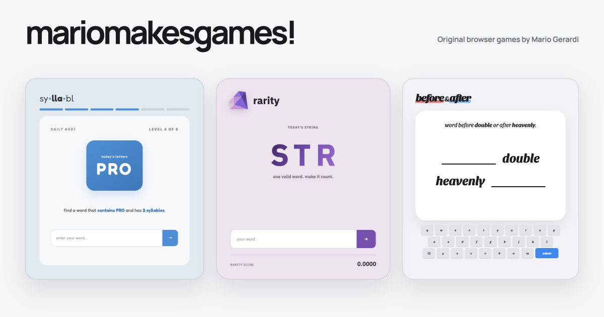

# mariomakesgames!

A collection of original browser games by Mario Gerardi.

[](https://github.com/mariogerardi/mariomakesgames/actions/workflows/ci.yml)



The hub gives each game its own visual identity and rules while keeping them
under one shared, responsive home. Syllabl, Rarity, Before&After, and DECODE
are live; TOKEN and DUAL are available as playtest previews; Expl41n and Gridl
have playable internal routes but remain locked on the public collection.

## Games

| Game | The idea |
| --- | --- |
| **Syllabl** | Find six words that satisfy changing letter-placement and syllable rules. |
| **Rarity** | Submit one valid word containing the daily string and make it count. |
| **Before&After** | Find the word that belongs before, after, or between two clues. |
| **DECODE** | Transform one word into another using color, position, and a crossword-style hint. |
| **TOKEN** | Predict the next token in a frozen AI response. |
| **DUAL** | Find English and Spanish words containing the same letter string. |
| **Expl41n** | Give an AI just enough of a clue to guess the secret word. |
| **Gridl** | Route word fragments across a map of crossings, blockers, recalls, and portals. |

## Run it locally

The project requires Node.js 22.13 or newer.

```bash
npm ci
npm run dev
```

Open [http://localhost:3000](http://localhost:3000).

DUAL has a local-only authoring view. To download the English and Spanish
Kaikki source snapshots and build its review index:

```bash
npm run dual:data
```

The roughly 4 GB source download, SQLite review database, and browser-facing
candidate pools are Git-ignored. Once built, the **Build** destination appears
only on DUAL pages served from localhost.

Some games use externally hosted word-validation, scoring, or guessing
services. Those integrations are isolated behind service modules so the game
engines and most automated tests remain deterministic.

## Quality checks

```bash
npm run check
```

The check runs catalog validation, type checking, linting, the complete test
suite, and a production build. Historical parity tests use locked source
revisions when matching sibling repositories are available and skip those
comparisons in a standalone checkout.

## Project map

- `app/` — shared hub routes, metadata, and global presentation
- `src/app-shell/` — shared navigation, cards, branding, and hero previews
- `src/games/` — isolated game UIs, engines, services, and authored catalogs
- `src/platform/` — shared daily, storage, sharing, analytics, and result boundaries
- `test/` — application, domain, contract, and historical parity coverage
- `docs/` — architecture decisions and migration records
- `.local/dual-kaikki/` — ignored DUAL source data and authoring database
- `contracts/` — preserved gameplay behavior for each migrated game

## Ownership

This is a public portfolio repository, not an open-source distribution. The
original game code, puzzle data, artwork, writing, and identities remain the
property of Mario Gerardi. See [LICENSE.md](LICENSE.md) and
[THIRD_PARTY_NOTICES.md](THIRD_PARTY_NOTICES.md).

Security concerns should follow the private-reporting guidance in
[SECURITY.md](SECURITY.md).
